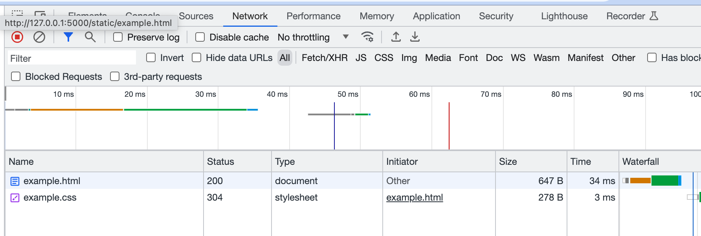
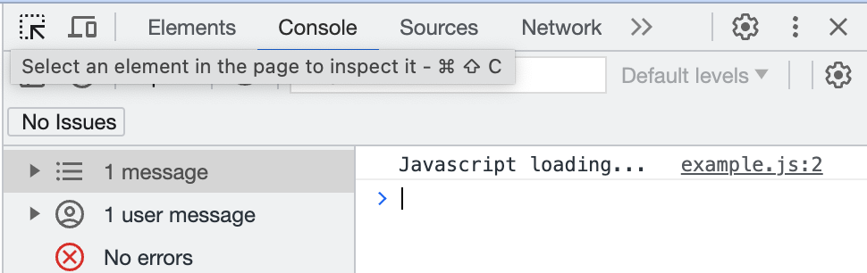

## WebApp Introduction

Web apps power today's internet. We build one ourselves.

### HTML & CSS
A webpage consists of various files in their own formats:
  * HTML: Contains the markup that describes the page's elements, and references other resources.
  * CSS: Describes the styles of the HTML elements.
  * Image files: for, well, images.
  * Javascript: Script files that may be executed on the client side (browser).

Let's build a simple web page consisting of one HTML file and one CSS, both stored in the folder `static` (we'll see why later):

```html
<!DOCTYPE html>
<html>
    <head>
        <link rel="stylesheet" href="example.css">
    </head>
    <body>
        <button>Click me!</button>
        <button>... me too!</button>
        <div id="text">Oh, nothing yet</div>
    </body>
</html>
```

```css
/* Style the body element. */
body {
    margin: 1em;
}

/* Style the div element with id `text`. */
#text {
    background-color: palegreen;
    font-family: monospace;
    margin: 1em 0;
    padding: 0.5em;
}
```

We can open the HTML page in the browser and click buttons - but nothing happens...

### Serve the Page
Opening web pages locally is not that much fun - our goal is to publish an app to the world!

For this, the files need to be _served_, which means that they need to be sent to the _client's_ browser when requested. Let's turn our computer into a web _server_ using [Flask](https://flask.palletsprojects.com/):

In a terminal window, install Flask into Python:
```bash
python -m pip install flask
```

Flask can do more things than just serving the files on our computer to the client, but for now, that is all we want: Send all the files in the `static` folder unmodified to the requestor. We create a tiny Python application in the top-level folder named `app.py` that essentially does nothing else:

```py
from flask import Flask

app = Flask("example app")
```

On the console, start the Flask web server:

```bash
flask run --reload
```

The `--reload` tells it to pick up changes to the files we serve, so we don't need to restart it while changing code.

If the `flask` command is not found, try calling `python -m flask run --reload` instead.

Ok, let's open the URL given on the command line, typically http://127.0.0.1:5000. 

The browser probably tells us that the webpage does not exist - well, our HTML file is at `static/example.html`, so let's navigate to http://127.0.0.1:5000/static/example.html.

### HTTP
The client (browser) and the server use the HTTP protocol to transfer the different files. If we open the developer tools in the browser, we can observe the transfers on the `Network` tab:



So the browser first loads the HTML page, reads it and discovers that it references the CSS page, then loads that as well, before it renders the entire page to the user.

Click on the files transferred - the detail pane contains a lot more information on the _request_ sent by the browser and the _response_ returned from the server.

Each request demands a certain _resource_ sent using a certain _method_. The _method_ describes the type of action to be taken, typically it is **GET**, but you will also come across **POST** to change a resource on the server side.

The request also contains additional information in _headers_, for instance:

  * **If-modified-since**: <timestamp>
    * Only transfer the resource it it was changed since the timestamp given.
    * Otherwise, ther server responds with a 304 status code, indicating that the client should use the copy of the resource it has cached from a previous visit.
  * **Referer**: Which site or host is requesting the resource.
  * **User-agent**:
    * Information about the browser and version.
    * May be used to distinguish mobile from desktop browsers.

The server answers with a [response code](https://de.wikipedia.org/wiki/HTTP-Statuscode) and additional information, for example the contents of the requested resource. The most important codes are:
  * **200** (OK): Request is successful, the requested resource is contained in the response.
  * **304** (UNMODIFIED): Request ist OK, the resource was not changed and is omitted from the response.
  * **404** (NOT FOUND): Resource not found.

### Javascript

Transferring static resources (files) using HTTP is all good, but can we use the same mechanism to transport other pieces of information from the server to the client? Of course!

We are going to use Javascript to make requests to our server. But before we do this, we need to get our feet wet with Javascript: the programming language that the browser (client) can execute.

Let's include a Javascript resource from our HTML, typically from within the `head` element:

```html
  <head>
    <script type="module" src="example.js"></script>
  </head>
```

Note that `script` uses the `src` attribute to name the file, while the `link` element uses `href` to include the CSS - never mind the inconsistency.

The `type="module"` attribute ensures that our Javascript is forced to be modern type Javascript and we don't need to bother with old quirks from the past.

Oh, we need to create the `example.js` file, of course, it should also be placed into the `static` folder. Let's write our first line of JS:

```js
console.log("Javascript loading...");
```

This line will put something into the browser's console (also visible from the developer tools) - much like the `print` function in Python. Reload the browser tab containing our webpage and check if something appears in the console!



#### Accessing the DOM
We can access the _Document Object Model_ (DOM), which is the tree of HTML elements displayed by the page, using the global `document` variable. Use `getElementById()` to find an element with a certain `id`, or `getElementsByTagName()` (note the plural) to retrieve all elements with a certain tag (element) name:

```js
let buttons = document.getElementsByTagName('button');
let textarea = document.getElementById('text');
console.log(`Text element says '${textarea.innerText}'`);
```

Note:
  * Variables need to be _declared_ using `let` when they are first used.
  * Statements are terminated by a semicolon (`;`), although they can usually be omitted.
  * Strings in backticks (\`) can be interpolated with expressions in `${}`.


#### Event Listeners
We would like to execute a bit of code when the buttons are clicked. We can attach a function to the `click` event as follows - remember that `buttons` contains the two buttons on our page.

```js
function handleClick() {
    console.log("button 1 clicked!");
}
buttons[0].addEventListener("click", handleClick);
```

Note:
  * Javascript follows the syntax of C or Java.
  * Curly braces for blocks.
  * A function is declared using the `function` keyword.
  * To attach the listener, we use the function's name but do not call it (no parentheses).

#### Modifying the DOM
Let's modify the DOM by adding child elements to the text element. Each added `div` has its `innerText` set.

```js
let clicks = 0;
function handleClick() {
    console.log("button1 clicked!");
    clicks += 1;
    // We can modify the DOM or parts of it
    let div = document.createElement("div");
    div.innerText = `Clicked ${clicks} time(s)!`;
    textArea.appendChild(div);
}
buttons[0].addEventListener("click", handleClick);
```

Note:
  * To add elements to the DOM, we need to first create them using the `document.createElement()` function and can then insert them in the correct location using `element.appendChild()`.
  * Text can be set on an element using the `innerText` property.

#### Dynamic Requests: Asynchronous Fetch
I promised we could make HTTP requests using Javascript - we use the `fetch()` function for this.

But there is a problem: network requests may take a long time, depending on network speed and server properties. We want to avoid freezing the browser while the request is under way. This can be achieved using the `async` and `await` keywords.

In the example below, we request a resource from wiewarm.ch - open it first [in a browser](https://www.wiewarm.ch/api/v1/bad.json/16) to see what it returns. Aha, we receive a piece of text in the JSON (JavaScript Object Notation) format that we can process very easily using Javascript. It's very similar to Python dictionaries and lists: named elements can be accessed using their _key_.

```js
async function updateTemperature() {
    const url = 'https://www.wiewarm.ch/api/v1/bad.json/16';

    let promise = fetch(url);
    let response = await promise;
    let json_data = await response.json();
    console.log(json_data);
    textArea.innerText = `Der Bodensee ist ${json_data.becken.Bodensee.temp}° warm.`;
}

buttons[1].addEventListener("click", updateTemperature);
```

Above, we define a new function `updateTemperature` which we later attach to the second button.

The HTTP request is initiated using the built-in `fetch` function. Because the request may take a while, the function does not return the server's response directly, but a `Promise` object instead.

A _promise_ is a handle for the future result of a longer running function. Once it is _fulfilled_, the result can be accessed. We can wait for it to _settle_ by using the `await` keyword prepended to the promise. Because `await` causes our function to become long-running too, we are required to mark it with `async`, which means that our function automatically also returns a promise to its callers.

Note how parsing the JSON text also produces a promise, because it could take longer for large objects. We use `await` here as well.

Let's try out what happens when we click on the second button! Make sure to also watch the requests being made on the _Network_ tab.

### Dynamic Responses

We have seen above how to make dynamic HTTP requests using Javascript, which allows us to modify the web page without reloading the entire page.

The response came from the `wiewarm.ch` server, and we have not yet given any thought to how the response was generated. Possibly, the server has many files for each public pool and its temperatures - on the other hand, it is more likely that the temperatures are stored in a database and the response is dynamically generated for each request.

This is also what we would like to achieve, in order to for example play a web game that is executed on the server.

Flask allows us to create _routes_, endpoints in Python code that respond to HTTP requests to certain paths. In our `app.py`, we can add routes as follows:

```py
@app.route("/hello/<name>")
def hello(name):
    return f"Nice to meet you, {name}!"
```

This tells Flask to send all requests that match `/hello/<something>` to the `hello` function, passing whatever was appended as function argument. We can directly return a string.

Let's test that code and go to http://localhost:5000/hello/world!

#### Returning JSON
If our route function returns a Python dictionary instead of a string, Flask turns it into JSON if possible. If we want to create our own temperature server (not necessarily with accurate temperature readings), we could add the following route:

```py
@app.route("/api/bodensee")
def json_api():
    response = { 'becken': {'Bodensee' : { 'temp' : 33.3 } } }
    return response
```

If we change the URL in our Javascript to point to the local endpoint, we now have a dynamic web page and a dynamic server that executes Python code whenever a matching request is made:

```js
  // (in updateTemperature)
  const url = '/api/bodensee';
```

## Next Steps
We now have all the tools in our hands to build web apps:
  * Author the HTML, CSS and JS files in `static` and serve them using Flask.
  * Dynamically fetch JSON data using Javascript and update the HTML accordingly.
  * Provide dynamic JSON content from our Flask server running Python.

For our web-app game, what we need to do is:
  * Move the static pages into the `static` folder.
  * Run the Python game from Flask.
  * Create Flask routes to play the game, and wire routes to the game on the server.
  * Update the HTML frontend based on the JSON responses from the server.